# Автосалон

Это учебный проект, созданный в процессе изучения курса по управлению базами данных в университете. Проект разработан на языке программирования C# с использованием фреймворка WinForms (.NET Framework v4.8) и подключается к локальной базе данных MySQL.

Основной задачей было разработать приложение с графическим интерфейсом, обеспечивающее подключение к базе данных. В рамках проекта реализованы следующие функции:

- Работа со всеми таблицами модели (добавление, редактирование и удаление данных).
- Вывод данных через представления (views).
- Вызов хранимых процедур.

## Схема базы данных
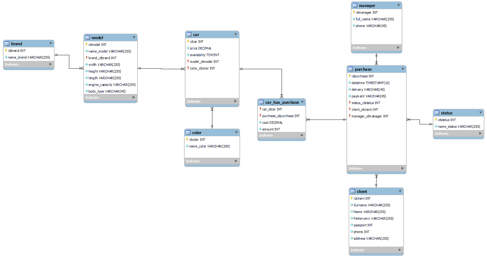

## Скриншоты приложения
Главная страница
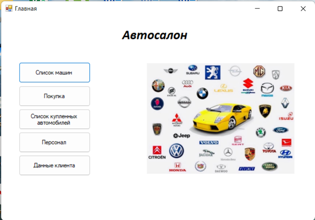

Отображение списка всех автомобилей
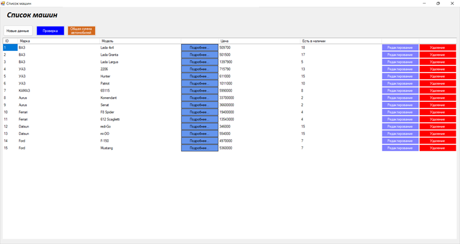

Добавление нового автомобиля в автосалон
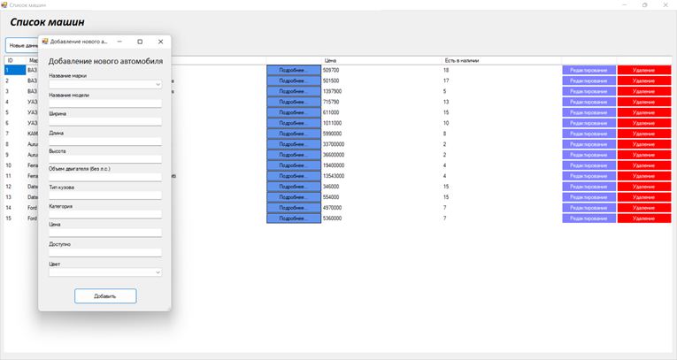

Подробная информация выбранного автомобиля
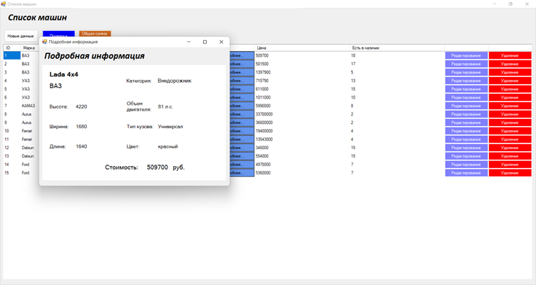

Расчет общей покупки всех автомобилей в автосалоне
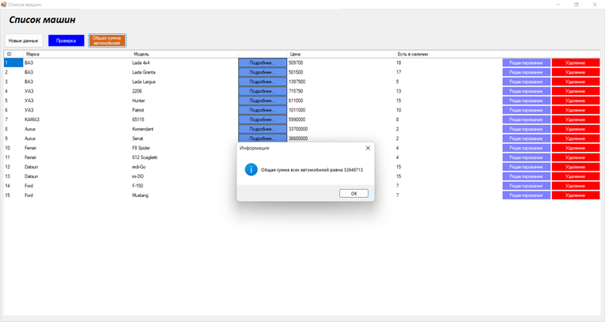

Интерфейс для покупки автомобиля
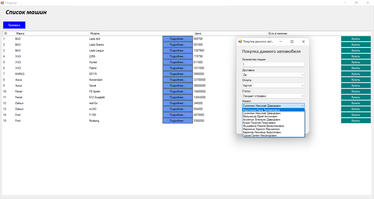

Отображение всех купленных автомобилей
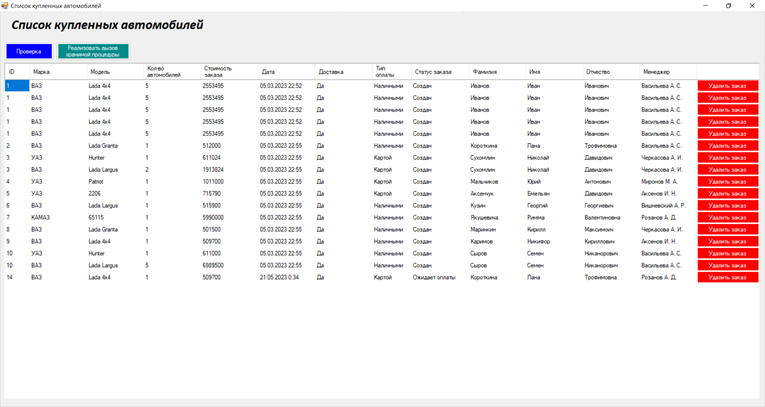

Отображение списка персонала
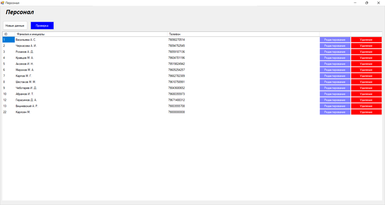

Отображение списка клиентов
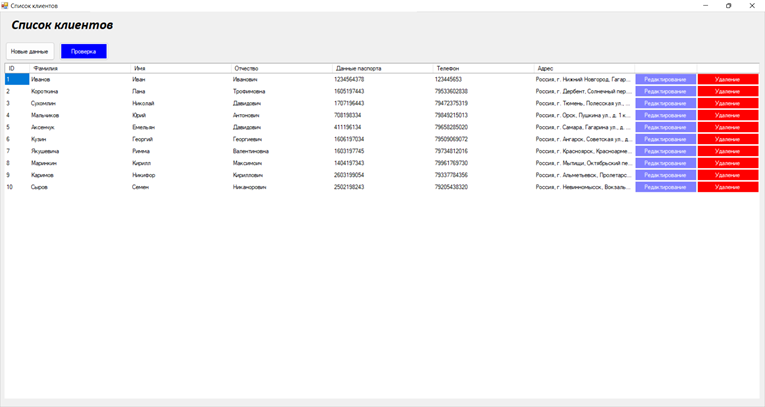

Добавление данных клиента/менеджера
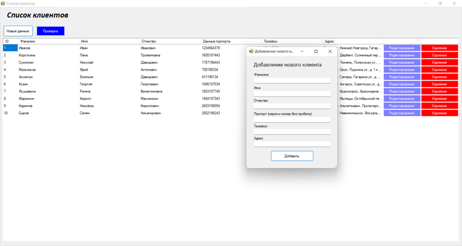